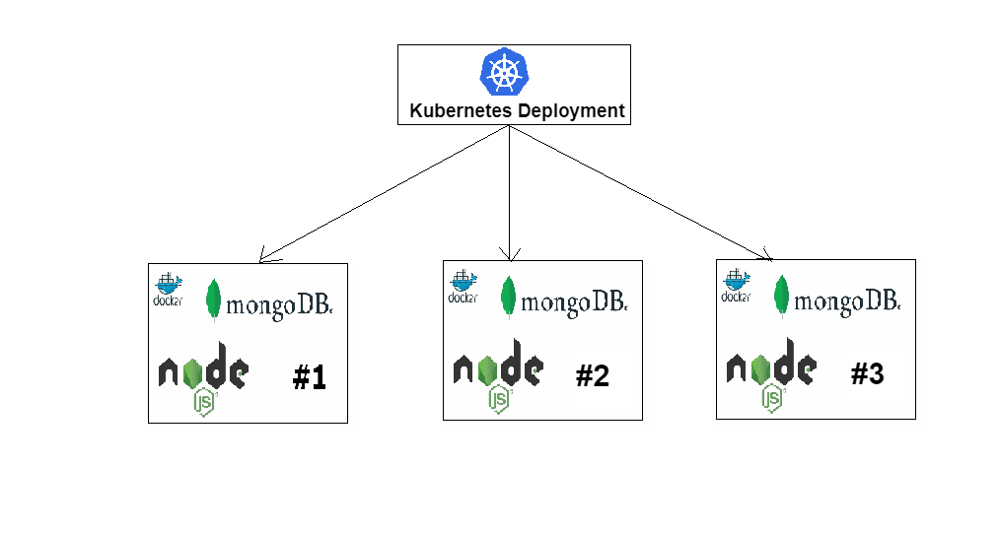
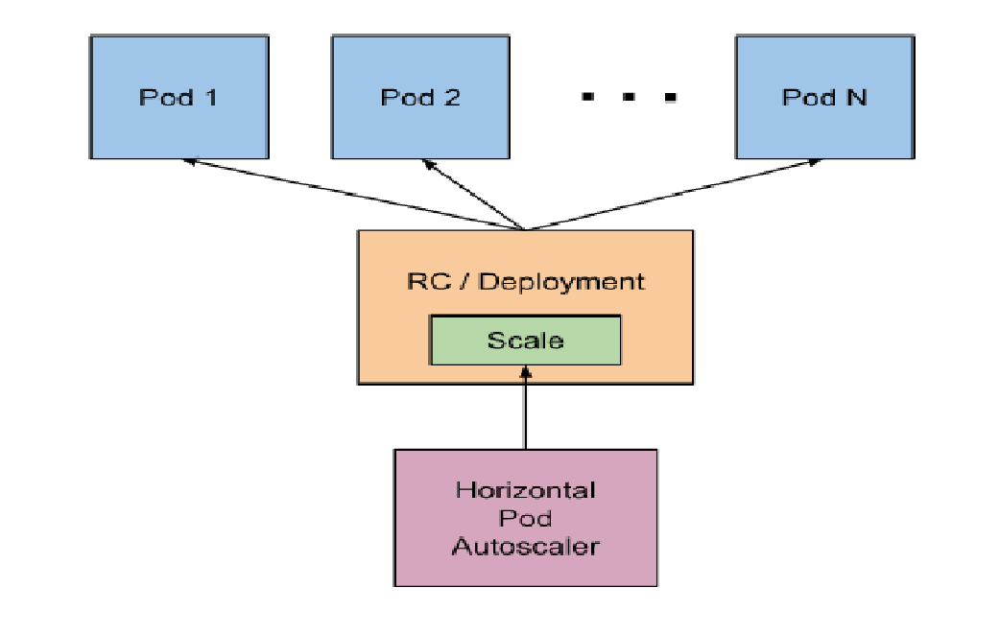

# node app with mongodb deployment with k8

## Create a diagram of node app with mongo deployment with min 3 replicas



## What is deployment?
* A Kubernetes Deployment is used to tell Kubernetes how to create or modify instances of the pods that hold a containerized application. Deployments can scale the number of replica pods, enable rollout of updated code in a controlled manner, or roll back to an earlier deployment version if necessary.
  
## What is a pod?
* Pod is a smallest deployable unit of computing that you can create and manage in Kubernetes.
 
## What is service?
* A service is responsible for enabling network access to a set of pods. We could use a deployment without a service to keep a set of identical pods running in the Kubernetes cluster. The deployment could be scaled up and down and pods could be replicated.

## What are secrets?
* A Secret is an object that contains a small amount of sensitive data such as a password, a token, or a key. ...

## What is volume?
* A Kubernetes volume is a directory that contains data accessible to containers in a given Pod in the orchestration and scheduling platform. ...

## What is config map?
* A ConfigMap is an API object that lets you store configuration for other objects to use. Unlike most Kubernetes objects that have a spec , a ConfigMap has data and binaryData fields. These fields accept key-value pairs as their values. ... The keys stored in data must not overlap with the keys in the binaryData field.

## Step by step documentation for the deployment nodeapp along with mongodb with K8
* create a 

## Definition of K8 resources:
* A resource is an endpoint in the Kubernetes API that stores a collection of API objects of a certain kind; for example, the built-in pods resource contains a collection of Pod objects.
 
## Cronjob
* CronJobs are meant for performing regular scheduled actions such as backups, report generation, and so on. Each of those tasks should be configured to recur indefinitely (for example: once a day / week / month); you can define the point in time within that interval when the job should start.

## Example: This example CronJob manifest prints the current time and a hello message every minute:
```python
#cron-job.yml
apiVersion: batch/v1
kind: CronJob
metadata:
  name: hello
spec:
  schedule: "*/1 * * * *"
  jobTemplate:
    spec:
      template:
        spec:
          containers:
          - name: hello
            image: busybox
            imagePullPolicy: IfNotPresent
            command:
            - /bin/sh
            - -c
            - date; echo Hello from the Kubernetes cluster
          restartPolicy: OnFailure
```
### Cron schedule syntax
```python
#      ┌────────────────── timezone (optional)
#      |      ┌───────────── minute (0 - 59)
#      |      │ ┌───────────── hour (0 - 23)
#      |      │ │ ┌───────────── day of the month (1 - 31)
#      |      │ │ │ ┌───────────── month (1 - 12)
#      |      │ │ │ │ ┌───────────── day of the week (0 - 6) (Sunday to Saturday;
#      |      │ │ │ │ │                                   7 is also Sunday on some systems)
#      |      │ │ │ │ │
#      |      │ │ │ │ │
# CRON_TZ=UTC * * * * *
```
### Run the below commands for cronjob:
```python
kubectl apply -f cron-job.yml
kubectl get cronjob
kubectl get job --watch
pods=$(kubectl get pods --selector=job-name=eng89-27163577 --output=jsonpath={.items[*].metadata.name})
```
## Auto-scaling HPA
* The Horizontal Pod Autoscaler automatically scales the number of Pods in a replication controller, deployment, replica set or stateful set based on observed CPU utilization (or, with custom metrics support, on some other application-provided metrics).

```python
#node-hpa.yml

apiVersion: autoscaling/v1
kind: HorizontalPodAutoscaler

metadata:
  name: sparta-node-app-deploy
  namespace: default

spec: 
  maxReplicas: 9
  minReplicas: 2
  scaleTargetRef:
    apiVersion: apps/v1
    kind: Deployment
    name: node
  targetCPUUtilizationPercentage: 50
```
## Sparta Node Sample App
### Description
* This app is intended for use with the Sparta Global Devops Stream as a sample app. You can clone the repo and use it as is but no changes will be accepted on this branch.

* To use the repo within your course you should fork it.

* The app is a node app with three pages.

### Homepage

``localhost:3000``

Displays a simple homepage displaying a Sparta logo and message. This page should return a 200 response.

### Blog

``localhost:3000/posts``

This page displays a logo and 100 randomly generated blog posts. The posts are generated during the seeding step.

This page and the seeding is only accessible when a database is available and the DB_HOST environment variable has been set with it's location.

### A fibonacci number generator

``localhost:3000/fibonacci/{index}``

This page has be implemented poorly on purpose to produce a slow running function. This can be used for performance testing and crash recovery testing.

The higher the fibonacci number requested the longer the request will take. A very large number can crash or block the process.


### Hackable code

``localhost:3000/hack/{code}``

There is a commented route that opens a serious security vulnerability. This should only be enabled when looking at user security and then disabled immediately afterwards

## Usage

Clone the app

```
npm install
npm start
```

You can then access the app on port 3000 at one of the urls given above.

## Tests

There is a basic test framework available that uses the Mocha/Chai framework

```
npm test
```

The test for posts will fail ( as expected ) if the database has not been correctly setup.


